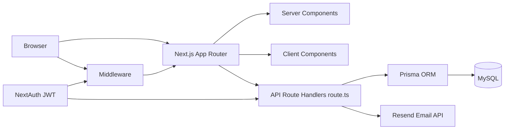
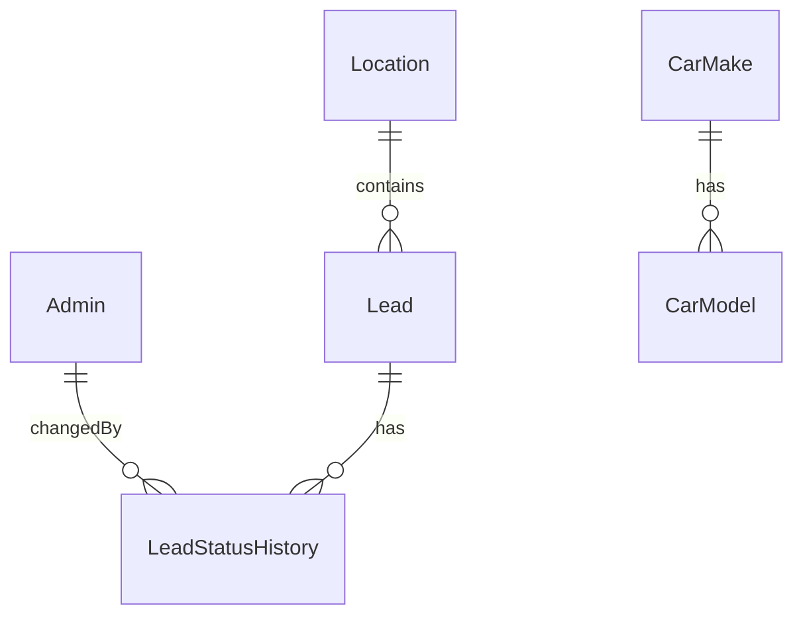

# Autoankauf Architecture Guide (Beginner to Senior View)

This file explains your website architecture in a simple way, but with senior-level structure and technical depth.

Goal of this guide:
- Understand your current codebase deeply
- Be able to explain it clearly to your client
- Learn Next.js architecture patterns you can reuse in your next project

---

## 1) What this project really is

Your project is not only a website. It is two systems in one Next.js app:

1. Public acquisition website
- SEO pages for Germany states/cities
- Multi-language content (de/en/fr)
- Lead form for car selling

2. Private admin CRM
- Login-protected dashboard
- Leads management and status workflow
- Settings area for car make/model catalog CRUD

Both systems live in one codebase and share:
- Same Next.js runtime
- Same Prisma database client
- Same deployment

---

## 2) High-level architecture (system view)



How to read this:
- Frontend pages are rendered by App Router pages/layouts.
- Backend APIs are implemented in route.ts files under src/app/api.
- Database access uses Prisma.
- Auth uses NextAuth credentials + JWT session.
- Middleware protects admin pages before rendering.

---

## 3) Next.js terms explained using your project

## App Router
- Folder-based routing in src/app
- Example:
  - src/app/[locale]/page.tsx -> homepage
  - src/app/api/leads/submit/route.ts -> backend API endpoint

## page.tsx
- Represents a route UI page.
- Usually server component by default.
- Example: src/app/[locale]/standorte/[state]/[city]/page.tsx

## layout.tsx
- Shared wrapper around pages.
- Good for Header/Footer/providers.
- Example: src/app/[locale]/layout.tsx wraps localized pages with Header + Footer.

## route.ts
- Backend endpoint file in App Router.
- Exports HTTP handlers like GET, POST, PATCH, DELETE.
- Example:

```ts
export async function GET(request: NextRequest) {
  // validate auth
  // query Prisma
  // return JSON
}
```

## Server Component vs Client Component
- Server component: no "use client", runs on server, can access DB directly.
- Client component: starts with "use client", runs in browser, uses hooks/events.
- Example:
  - Server: src/app/admin/(protected)/dashboard/page.tsx
  - Client: src/components/forms/lead-form.tsx

## Middleware
- Runs before route handling.
- Your middleware handles:
  - Admin route auth redirects
  - Locale routing via next-intl
- File: src/middleware.ts

## generateStaticParams
- Pre-generates dynamic routes at build time.
- Used heavily for location SEO pages.
- Files:
  - src/app/[locale]/page.tsx
  - src/app/[locale]/standorte/[state]/page.tsx
  - src/app/[locale]/standorte/[state]/[city]/page.tsx

## generateMetadata
- Dynamic SEO metadata per page.
- Used for state/city pages and locale layout metadata.

---

## 4) Core folder architecture

## Root config layer

- package.json
  - Scripts and dependencies
  - Build includes prisma generate before next build
- next.config.mjs
  - next-intl plugin integration
  - image remotePatterns
  - optimizePackageImports for lucide-react
- tsconfig.json
  - strict TypeScript
  - @/* alias to src/*
- tailwind.config.ts
  - design system tokens (navy/gold), animations, utilities
- postcss.config.mjs
  - Tailwind + autoprefixer
- .env.example
  - full environment variable contract

## Runtime and routing layer (src/app)

- src/app/layout.tsx
  - root HTML/body wrapper
- src/app/[locale]/layout.tsx
  - localized shell with next-intl provider + Header/Footer
- src/app/[locale]/page.tsx
  - homepage composition
- src/app/admin/layout.tsx
  - admin layout root for /admin segment
- src/app/admin/(protected)/layout.tsx
  - server-side guard for protected admin pages

## API backend layer (src/app/api)

All backend endpoints are here as route.ts handlers.

---

## 5) Full API route.ts map (what each file does)

| File | Methods | Auth | Responsibility |
|---|---|---|---|
| src/app/api/auth/[...nextauth]/route.ts | GET, POST | NextAuth internals | NextAuth entrypoint for credential login/session |
| src/app/api/leads/submit/route.ts | POST | public + origin checks | Receives lead form, validates/sanitizes, rate limits, stores lead, sends emails |
| src/app/api/cars/makes/route.ts | GET | public | Returns DB-backed car makes for public form |
| src/app/api/cars/makes/[make]/models/route.ts | GET | public | Returns models for selected make ID |
| src/app/api/admin/stats/route.ts | GET | required | Admin dashboard stats |
| src/app/api/admin/leads/route.ts | GET | required | Leads list with filter/search/sort/pagination |
| src/app/api/admin/leads/[id]/route.ts | GET, DELETE | required | Lead detail + delete lead |
| src/app/api/admin/leads/[id]/status/route.ts | PATCH | required | Update lead status + insert status history |
| src/app/api/admin/leads/[id]/notes/route.ts | PATCH | required | Update admin internal notes |
| src/app/api/admin/me/password/route.ts | PATCH | required | Change admin password (bcrypt verify + hash) |
| src/app/api/admin/cars/makes/route.ts | GET, POST | required | List/create car makes for settings CRUD |
| src/app/api/admin/cars/makes/[id]/route.ts | GET, PATCH, DELETE | required | Read/update/delete one make |
| src/app/api/admin/cars/models/route.ts | GET, POST | required | List/create car models for settings CRUD |
| src/app/api/admin/cars/models/[id]/route.ts | GET, PATCH, DELETE | required | Read/update/delete one model |

Important architecture detail:
- Middleware matcher excludes /api.
- So API auth is not from middleware.
- Each admin API route explicitly checks session with getAdminSession().

---

## 6) Data architecture (database + static content)

Your app uses two data sources by design:

1. Database (dynamic/business data)
- Prisma models in prisma/schema.prisma
- Used for:
  - Admin users
  - Leads
  - Status history
  - Car makes/models
  - Settings flags

2. JSON content (SEO/location content)
- src/data/locations/** JSON files
- Loaded via src/data/location-data.ts
- Used for state/city SEO pages

This hybrid approach is common:
- DB for changing transactional data
- JSON for large controlled content trees

### Key Prisma models

- Admin
  - login identity and role
- Lead
  - customer inquiry
- LeadStatusHistory
  - status transitions audit trail
- CarMake / CarModel
  - catalog options for form and admin settings
- Setting
  - app-level feature flags (example: car catalog initialized)



Note:
- Lead stores carMake/carModel as text fields (not foreign keys).
- New form still submits makeId/modelId, then backend resolves names and stores strings.
- This gives backward compatibility for existing lead records.

---

## 7) End-to-end runtime flows (simple but senior)

## Flow A: Visitor opens a localized page

Example URL: /en/standorte/bayern/munchen

1. Request enters middleware (src/middleware.ts)
2. Not an admin route -> passed to next-intl middleware
3. [locale] segment resolved
4. Locale layout loads messages and wraps page with Header/Footer
5. Page server component renders content from location JSON helpers

Why this is strong:
- Clean SEO URL structure
- Build-time static params for many pages
- Centralized locale behavior

## Flow B: Lead form submission

Frontend file:
- src/components/forms/lead-form.tsx

Backend file:
- src/app/api/leads/submit/route.ts

Steps:
1. Client form sends POST to /api/leads/submit
2. Backend checks origin/referer allowlist (basic CSRF defense)
3. Backend rate limits by IP
4. Backend validates and sanitizes payload
5. Backend resolves make/model IDs from DB
6. Backend creates lead in DB
7. Backend sends confirmation + admin email through Resend

Example from your route:

```ts
const limit = rateLimit(ip, 5, 10 * 60 * 1000);
if (limit.limited) {
  return NextResponse.json({ error: "Zu viele Anfragen" }, { status: 429 });
}
```

## Flow C: Admin authentication and protected pages

1. Login page uses next-auth signIn("credentials")
2. NextAuth route handler validates user via bcrypt + Prisma
3. JWT session is issued
4. Middleware blocks/redirects admin page access if no token
5. Protected admin pages render inside AdminShell

Files involved:
- src/app/admin/login/page.tsx
- src/app/api/auth/[...nextauth]/route.ts
- src/lib/auth.ts
- src/middleware.ts
- src/app/admin/(protected)/layout.tsx

## Flow D: Admin updates lead status

1. Client UI calls PATCH /api/admin/leads/[id]/status
2. Route validates payload with Zod
3. Route updates Lead status and timestamps
4. Route inserts LeadStatusHistory row in same transaction

This is a good pattern: business update + audit log in one atomic write.

## Flow E: Car catalog settings CRUD

1. Admin settings UI (CarCatalogManager) calls admin cars APIs
2. APIs ensure session, validate input, enforce uniqueness
3. Public form endpoints read same DB catalog
4. Lead form options update without full deploy

Files:
- src/components/admin/CarCatalogManager.tsx
- src/app/api/admin/cars/**/route.ts
- src/app/api/cars/**/route.ts
- src/lib/car-catalog.ts

---

## 8) Security architecture (what is implemented)

## Implemented protections

- Authentication
  - NextAuth credentials provider with bcrypt hash comparison
- Authorization
  - Admin routes require session checks
- Brute-force login limiter
  - src/lib/login-limiter.ts (email-based lockouts)
- Lead submission rate limit
  - src/lib/rate-limit.ts (IP sliding window)
- Input validation
  - Zod schemas in src/lib/validations/admin.ts
- Input sanitization
  - src/lib/sanitize.ts used in lead submission/email templates
- Basic CSRF-style origin check for public lead submit
  - in src/app/api/leads/submit/route.ts
- Logging strategy
  - src/lib/logger.ts keeps production logs minimal except errors
- Crawling control
  - robots disallow /api and /admin

## Senior observations (important)

1. In-memory rate limiters and login limiter
- Good for single-server setups
- Not shared across multiple instances
- If you scale horizontally, move to Redis-based limiter

2. CORS
- There is no global CORS header middleware (which is fine for same-origin apps)
- Current APIs are designed for same-origin usage
- If you need external clients, add explicit CORS policy route-by-route

3. CSRF consistency
- Lead submit has origin check
- Admin mutation endpoints rely mainly on authenticated session cookie
- For stricter posture, add CSRF token validation to admin write endpoints

4. Secrets and environment discipline
- .env.example is good and clear
- Ensure production values are only in host environment, never committed

---

## 9) Internationalization architecture (next-intl)

Files:
- src/lib/i18n.ts -> locale list + default locale
- src/i18n.ts -> request config and dynamic message loading
- src/middleware.ts -> locale routing strategy
- src/messages/*.json -> translations

Behavior:
- localePrefix: "as-needed"
- localeDetection: false
- default locale is de

What this means:
- German can appear without prefix
- Other locales can be prefixed (/en, /fr)
- Locale is deterministic (not browser auto-detected)

---

## 10) SEO architecture

## Route-level metadata
- generateMetadata in state/city pages and locale layout
- Titles/descriptions vary by route context

## Programmatic sitemap
- src/app/sitemap.ts generates static + state + city URLs for all locales

## Robots
- src/app/robots.ts disallows admin and API crawling

## Structured data
- BreadcrumbSchema, LocalBusinessSchema, FAQSchema components are injected in SEO pages

This is strong for local SEO and rich results.

---

## 11) How frontend and backend live together in Next.js here

Simple explanation:
- Frontend pages and backend APIs are siblings in src/app.
- page.tsx renders UI.
- route.ts handles HTTP.
- They share TypeScript types, helpers, auth, and Prisma.

Business advantage:
- Less integration friction than separate frontend/backend repos
- Easier to keep form fields, validation, and DB schema aligned

Technical advantage:
- Server components can query DB directly for SSR pages
- Client components can call API routes for user-triggered actions

---

## 12) Key files and roles (quick index)

## Routing and runtime
- src/middleware.ts: admin guard + locale routing
- src/app/layout.tsx: root wrapper
- src/app/[locale]/layout.tsx: localized app shell
- src/app/admin/(protected)/layout.tsx: server-side admin session gate

## Auth and session
- src/lib/auth.ts: NextAuth configuration
- src/lib/auth-utils.ts: getAdminSession helper
- src/app/api/auth/[...nextauth]/route.ts: auth endpoint

## Database and models
- prisma/schema.prisma: data models and relations
- src/lib/db.ts: Prisma client singleton
- prisma/seed.ts: admin bootstrap + initial catalog seeding

## API and validation
- src/app/api/**/route.ts: backend HTTP handlers
- src/lib/validations/admin.ts: Zod schemas for admin APIs
- src/lib/sanitize.ts: sanitization helpers
- src/lib/rate-limit.ts: rate limiting helper
- src/lib/login-limiter.ts: login attempt lockout helper

## Frontend data consumers
- src/components/forms/lead-form.tsx: public lead submission UI
- src/components/admin/CarCatalogManager.tsx: admin make/model CRUD UI
- src/app/admin/(protected)/dashboard/page.tsx: server-rendered dashboard

## Content/data source
- src/data/location-data.ts: location content loader API
- src/data/locations/**: nation/state/city JSON source
- src/data/car-makes.ts: legacy/default car catalog data source

---

## 13) Practical "how to explain this to a client" script

Use this short narrative:

"Our platform is one Next.js application with two parts: a public multilingual lead-generation site and a private admin CRM. The same system handles frontend pages and backend APIs. Lead submissions are validated, sanitized, rate-limited, saved in MySQL through Prisma, and notification emails are sent automatically. Admin access is protected with secure login sessions, and operational pages are optimized for SEO using dynamic metadata, sitemap generation, and structured data."

---

## 14) Senior architect checklist for your next Next.js project

Use this checklist before coding:

1. Routing design
- Define public routes, admin routes, API routes
- Decide dynamic segments and locale strategy early

2. Data boundaries
- Decide what is DB data vs static content
- Keep one source of truth per domain

3. Security baseline
- Auth, authz, validation, sanitization, rate limits
- Plan CSRF and CORS policies explicitly

4. Rendering strategy
- Choose per page: static, dynamic SSR, client-only
- Keep heavy data logic in server components

5. SEO baseline
- metadata, sitemap, robots, structured data

6. Operations
- env contract, seed strategy, logging, backup plan

7. Scaling readiness
- replace memory limiters with shared storage when scaling

---

## 15) Important notes observed in current repository

1. README says PostgreSQL, but Prisma datasource is currently MySQL.
- Update README to avoid onboarding confusion.

2. You are already using strong modern patterns:
- App Router
- next-intl
- NextAuth JWT sessions
- Prisma data layer
- route.ts API boundaries
- schema-based validation

3. Recent architecture upgrade is solid:
- Car makes/models moved to DB-backed CRUD
- Public form now reads from same DB source as admin settings

---

If you want, I can create a second file called Autoankauf-Deep-Dive.md with sequence diagrams for each critical flow (lead submit, login, status update, catalog CRUD) and a production hardening roadmap (Redis rate limit, CSRF tokens, audit/event logging, backup strategy, observability).